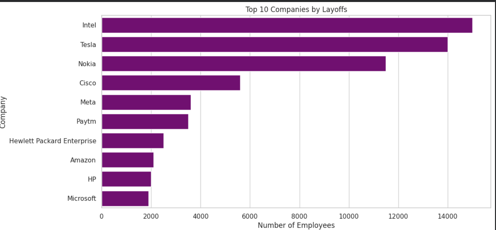
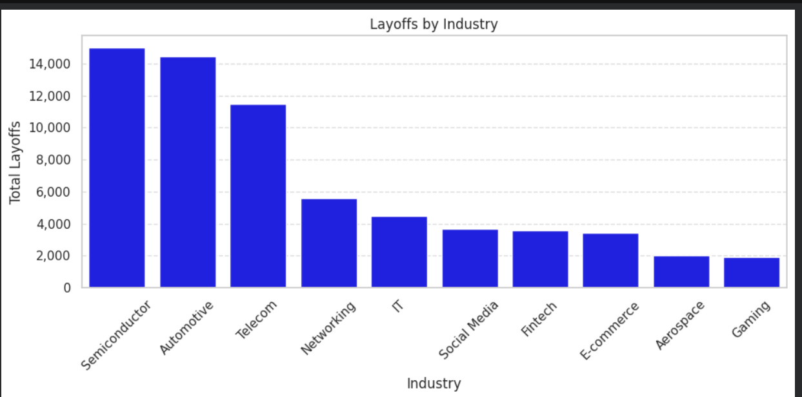
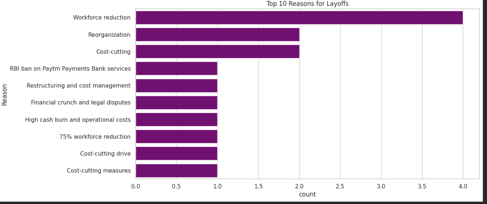
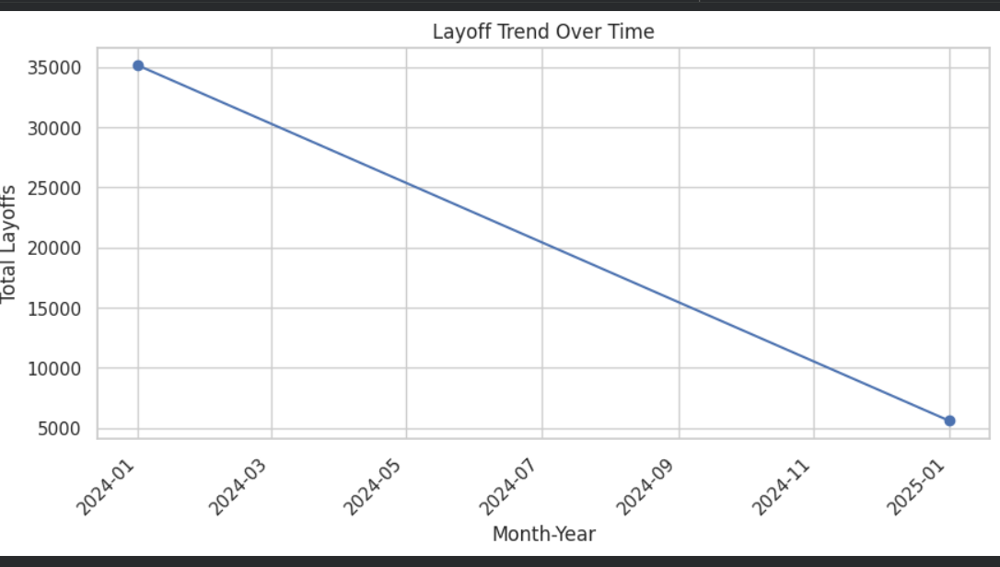

# 🌍 Global Layoff Analysis — Python Data Analytics Project

## 📌 Project Overview

Workforce reductions have become a major global business trend across technology, finance, retail, and startup ecosystems. Organizations are restructuring operations to manage costs, improve efficiency, and adapt to changing economic conditions.

This project performs **Exploratory Data Analysis (EDA)** on global layoff data to uncover patterns behind workforce reductions across industries, companies, and geographic locations using Python.

The analysis transforms raw layoff records into actionable insights that help understand **market behavior, organizational strategy, and industry risk trends**.

---

## 💼 Business Problem

Companies, investors, and analysts need to understand:

* Which industries are most vulnerable to layoffs?
* Are layoffs driven by economic slowdown or internal restructuring?
* Which regions experience higher workforce reductions?
* How funding status impacts employee stability?
* What strategic patterns exist behind large-scale layoffs?

Without structured analysis, layoff information remains scattered across news sources and reports, making strategic decision-making difficult.

This project aims to convert fragmented layoff data into **data-driven business intelligence**.

---

## 🎯 Project Objectives

* Analyze layoffs across industries and companies
* Identify most affected business sectors
* Study geographic distribution of layoffs
* Examine company funding status vs workforce stability
* Discover major reasons behind organizational downsizing
* Generate insights supporting workforce and market analysis

---

## 📊 Dashboard Preview

---

## 🛠️ Tools & Technologies

* **Python**
* **Pandas** — Data Cleaning & Transformation
* **Jupyter Notebook / Google Colab**
* **Data Visualization**
* **Git & GitHub**

---

## 🔎 Analytical Workflow

1. Data Collection from publicly reported layoff sources
2. Data Cleaning and Standardization
3. Exploratory Data Analysis (EDA)
4. Visualization of industry and company trends
5. Business Insight Generation

---

## 📂 Project Structure

global-layoff-analysis-python/

├── data/ → Dataset
├── notebooks/ → Python Analysis Notebook
├── images/ → Visualization Outputs
├── README.md
├── requirements.txt
├── LICENSE
└── .gitignore

---

## 📈 Key Insights

* Technology and startup ecosystems experienced the highest layoffs
* Cost optimization and restructuring were dominant drivers
* Well-funded companies also conducted workforce reductions
* Layoffs occurred globally, indicating macroeconomic impact
* Post-pandemic operational correction influenced hiring strategies

---

## ▶️ How to Run the Project

1. Clone the repository
2. Open the notebook in Google Colab or Jupyter
3. Install dependencies:

pip install -r requirements.txt

4. Run all notebook cells

---

## 👩‍💻 Author

**Anshika Goyal**
Aspiring Data Analyst | Python | SQL | Data Visualization
